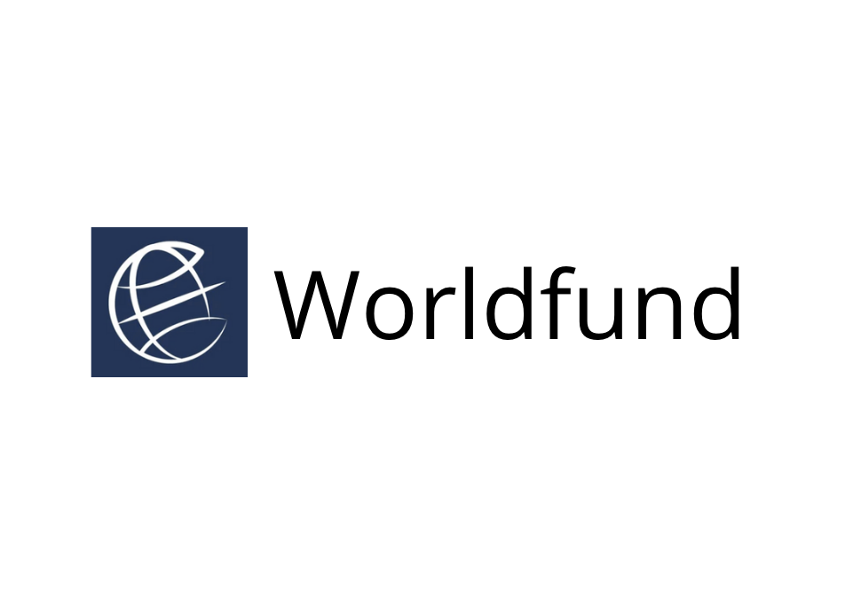
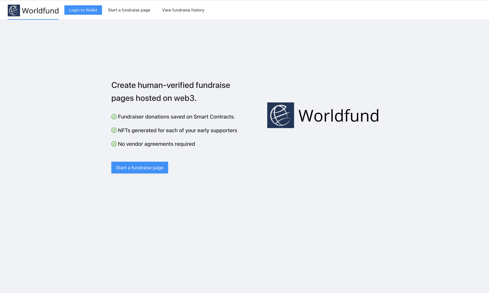
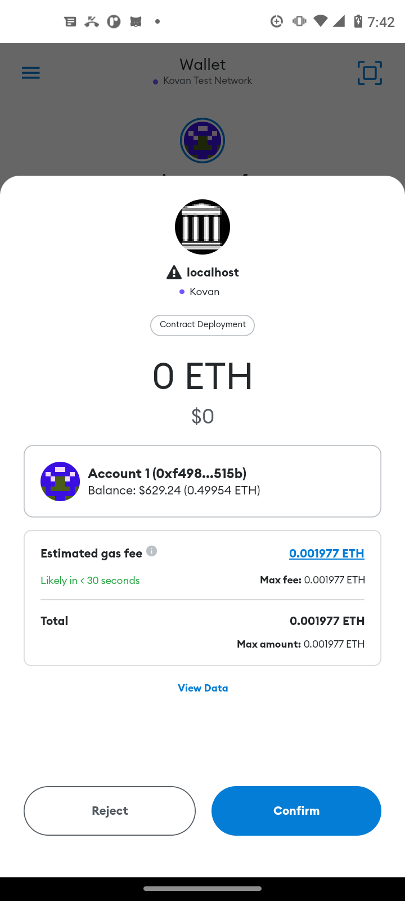
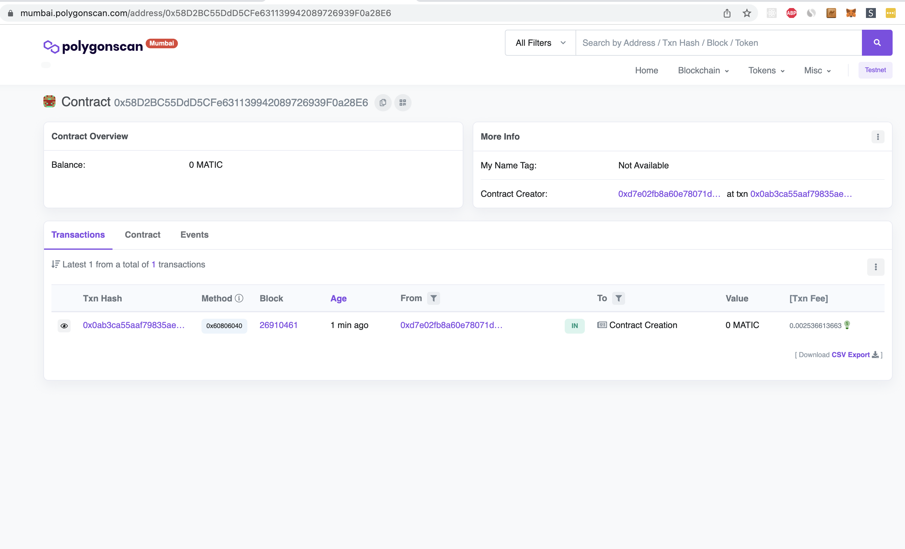
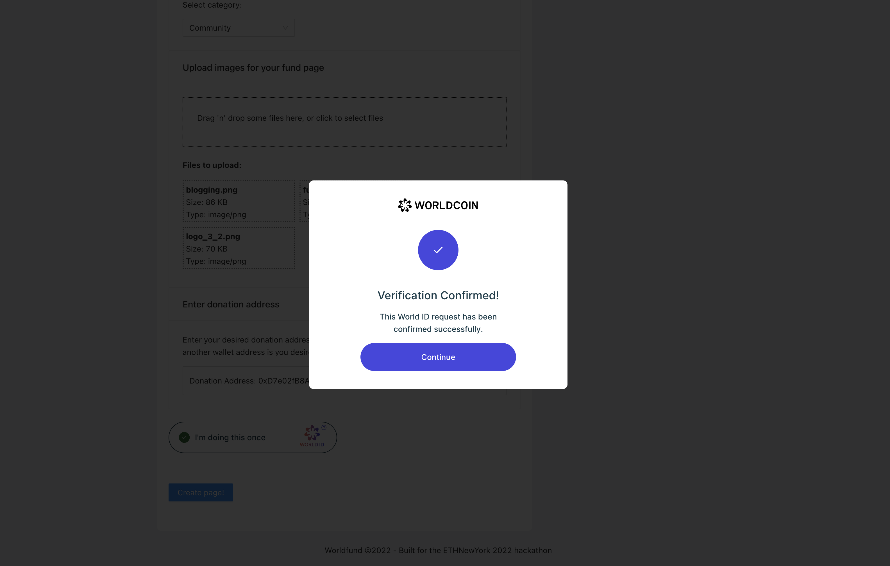
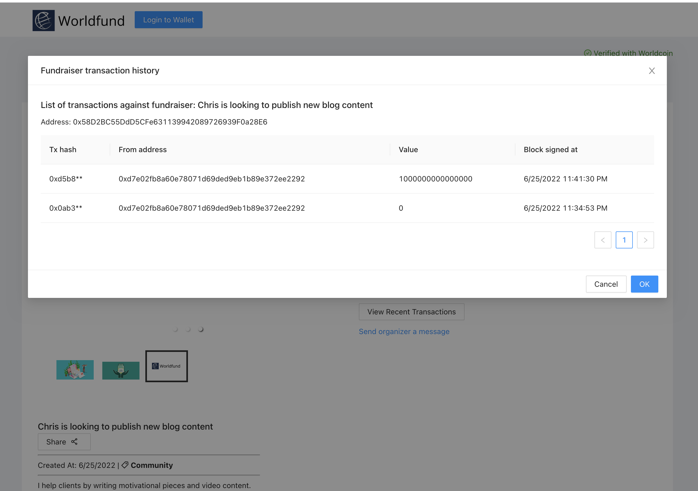
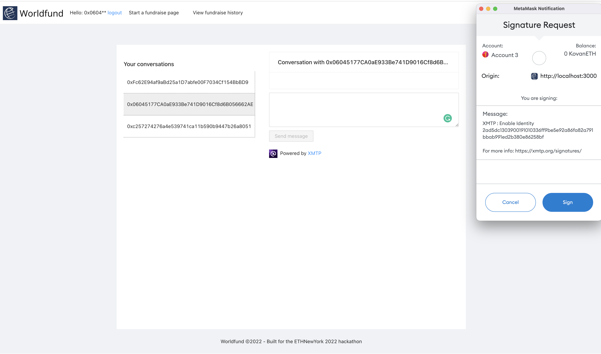

    

Worldfund
###

Create free fundraiser pages powered by smart contracts, with assets and resources managed on IPFS.

Payments facilitated on smart contracts.

This app is served completely by decentralized networks.

<!-- Try it out <a href="worldfund.surge.sh" target="_blank">here</a>! (requires Metamask connected to Polygon testnet). -->

### Context

There's a lot of platforms that already exist to do fundraising (as well as potentially decentralized fundraising).

However, these often:
1) Charge credit card fees for every credit-card driven payment or donation
2) Don't support anonymous donations without user accounts.
3) Don't support crypto-based payments.
4) Create general-purpose urls that are shareable anywhere without needing a user account.
5) Perform human-validation to avoid robot-generated fundraise links and potentially duplicate fundraisers.
6) Charge for active use and hosting.

Worldfund is a platform for anyone to create an open fundraise page for anything that drives them.

### Benefits

- Worldfund enables anyone to create and collect funds via Polygon without a vendor agreement. A polygon smart contract is deployed for each request.
- When a donation is completed, an NFT is generated that links both the signer's signature and the documents being agreed on.
- Hosted documents and the request are immutable.
- If there's not a valid worldcoin proof on the contract, the donate function is blocked / prevented when attempted.
- Smart contract deployed on Polygon which marks the progress/fulfillment of the fundraise request. 
- When done the contract can be marked inactive by the owner - preventing future donations from being accepted on the contract.
- View history of requests and completed fundraises using the covalent chain history API directly from the app.
- Fundraise links could be posted anywhere including social media profiles.

### Technologies used
* Walletconnect: Mobile-based authentication to the Worldfund application. Provides a deeper security layer than browser-extension alone by avoiding holding the user's private key in the browser. Enables the user to authorize contract deployments and donations from a separate device/desktop wallet while interacting with the website.
* Filecoin/IPFS: Storage of worldfund page assets. Data and files stored on IPFS are immutable and added free of charge for the end user. When a Fundraiser page is served, an API call fetches the static metadata file and renders the content based on cid to the screen.
* Worldcoin: Verifies a human is present / initiating all deploys of fundraisers on the Worldfund website. Generation of the fundraise record / proof. Attaches the final fundraise/agreement to an NFT and saves a link to it in the smart contract. Signal is the user's active address, while the action id is a combination of the address and the title of the current fundraiser. This 1) prevents duplicate fundraiser urls from being created or share, and 2) confirms that a human is making the page.
* NFTPort: Offers a souvenir 'celebration' emoji NFT minted whenever a user makes a donation to a Worldfund page.
Covalent: Blockchain data api (get history of donations for certain contracts, viewable in-app)
* XMTP: Messaging on the listing page. Every listing page has a 'Start conversation with owner' button which pulls the owner of the fundraiser page (by address), and enables the user to open up a new chat page / dialog with them. This can be used for private communication and questions about the page. The js library was used here.
* Covalent: Enables in-app history queries of past fundraise requests and fulfillment for a given polygon address. Each row in the app modal can be clicked and takes the user directly to the transaction explorer page for the given donation.
* Polygon: In-app deployment of the request smart contract and emits a contract event every time a new donation is delivered to a given funraiser contract. A new Polygon contract is deployed for each new fundraise request. Polygon enables fast transactions and low cost so users can donate even small amounts without incurring large gas fee overhead.

#### Change active network
Go to constants -> `ACTIVE_CHAIN`.
App currently has support for mumbai, polygon mainnet, and kovan (for eth network testing).

<!--
Demo flow:
1. Context
Kickstarter
New solutions coming out all the timehttps://www.tiptopjar.com/?ref=producthunt
2. App
Create new fundraise page flow
Upload image
Worldcoin enforses that a person only creates a page once, and that there aren't fraudulent users attempting to raise money for their projects or impersonating the creator.
Donate
Add messages to pages (stored on the contract or in a web3 storage mechanism)
Smart-contract managed
Free, no fees
Can embed your url in your social media profile. 
URL hosted on surge
3. Conclusion

-->

<!-- <b>This project is a hackathon prototype and would require additional work / deployment to be production ready. -->

---

To run/demo the project locally, Worldfund requires the following environment variables.

<pre>
    REACT_APP_COVALENT_KEY={YOUR_COVALENT_API_KEY} # Covalent key for the history page.
    REACT_APP_NFT_PORT_KEY={YOUR_NFT_PORT_API_KEY} # NFT port api key for receipt creation.
    REACT_APP_STORAGE_KEY={YOUR_WEB3_STORAGE_KEY} # web3.storage key for file hosting.
    REACT_APP_INFURA_ID={YOUR INFURA ID} # Your Infura RPC ID
</pre>

---

After declaring the above environment variables, use the below command to start the project:
`yarn; yarn start`

Recompiling Worldfund contract:
`cd contracts; npx hardhat compile`

### Screenshots

#### Home page

#### Fundraise page

#### Creating a new page

#### Using WalletConnect to authorize a transaction from a mobile wallet

#### Deploying a contract to polygon

#### Assets get hosted to IPFS automatically for each page.

#### Validating with world id

#### Example deployed contract with transactions

#### Starting a conversation with a Worldfund page owner

### Useful links
* Sponsors: https://showcase.ethglobal.com/ethnewyork2022/prizes
<!-- * https://www.npmjs.com/package/@usedapp/core -->